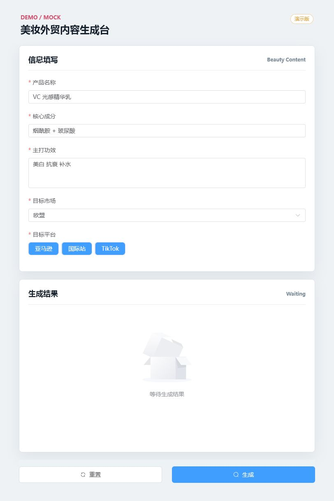
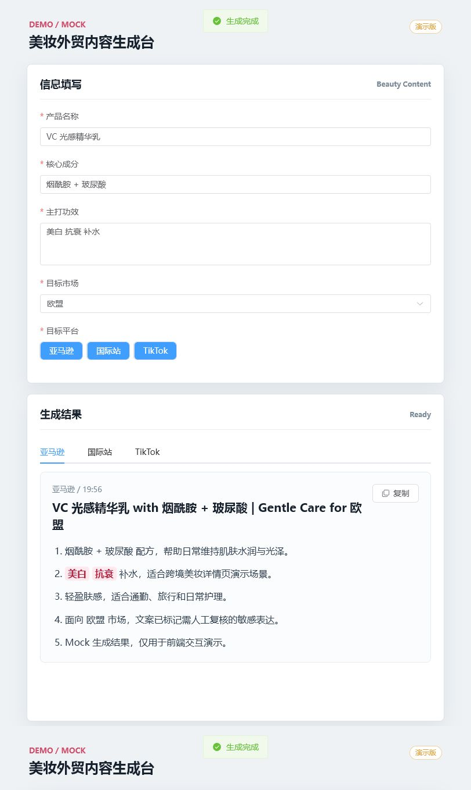

# 美妆外贸内容生成 Demo

## 运行说明

```bash
git clone git@github.com:ROJIN111/beauty-demo-frontend.git
cd beauty-demo-frontend
npm install
npm run dev
```

演示版前端项目，使用 Vue3 + Vite + Element Plus。本地 Mock 数据，不对接真实接口。

## 页面截图

正常填写状态：



生成结果状态：


